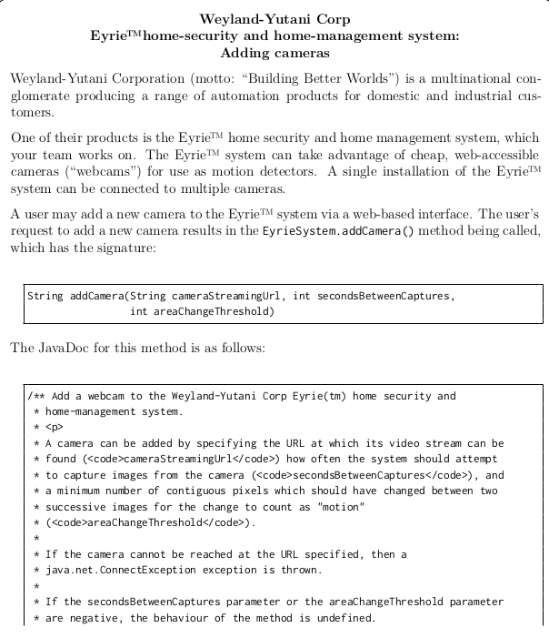
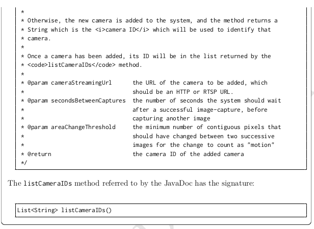
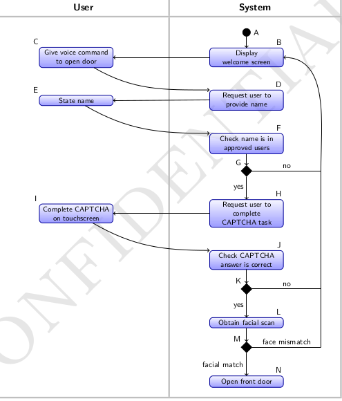
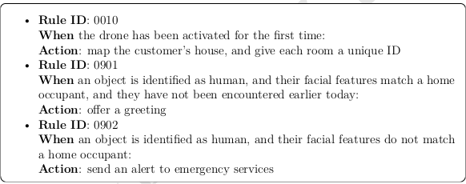

## Ame Liu

The `test_1`-`test_5` folders contain the different tests.

Some tests may only be part of the overall test.

### test_1
Working on a document generator program called JDocGen, written in Java.

To use follow 5 kinds testing method.

A. Parser – ISP test design

B. Parser – ISP test code

C. Parser – syntax-based testing

D. ShellProcessor tests

E. Logic-based tests

### test_2
A small snapshot of some actual cases, only partially intercepted.

`shopping_test.java`

This code tests a class called `ShoppingCart` that has methods for adding and removing `Item` objects, as well as getting the total price and a list of items in the cart. The tests use JUnit to verify that the methods work correctly, by creating a `ShoppingCart` object, adding and removing items, and checking the total and list of items in the cart.

`factorial_number_test.java`

This code tests a class called `Factorialcalculator` that has a method for calculating the factorial of a number. The tests use JUnit to verify that the method works correctly, by creating a `Factorialcalculator` object and calling the `calculateFactorial` method with various inputs. The first test verifies that the factorial of 0 is 1 , the second test verifies that the factorial of a positive number is calculated correctly, and the third test verifies that an exception is thrown when calculating the factorial of a negative number.

`binary_search_algorithm_test.java`

This code tests a class called `Binarysearch` that has a static method for performing a binary search on an array of integers. The tests use JUnit to verify that the method works correctly, by creating various arrays of integers and calling the `search` method with various inputs. The first test verifies that an empty array returns -1 , the second test verifies that a value that is not in the array returns -1 , the third test verifies that a value that is in the array is correctly found, the fourth test verifies that duplicate values are handled correctly, and the fifth test verifies that the method works correctly with a large array of integers.

`Tic_Toc_game_test.java`

This code tests a class called `TicTacToe` that implements a Tic Tac Toe game. The tests use JUnit to verify that the various methods of the class work correctly, by creating a `TicTacToe` object and calling the `mark` method to place marks on the board, and the `checkWinner` method to check if there is a winner. The first three tests verify that the `mark` method correctly handles placing marks on empty and occupied squares, and invalid squares. The last three tests verify that the `checkWinner` method correctly detects winning and non-winning game configurations.

`Hangmanm_game_test.java`

This code tests a class called `Hangman` that implements a Hangman game. The tests use JUnit to verify that the various methods of the class work correctly, by creating a `Hangman` object with a secret word, calling the `guess` method to make guesses, and calling the `etHiddenWord`', `isGamaWon`, and `isGameLost`methods to check the status of the game. The first test verifies that the `gethiddenWord` method correctly returns an array of underscores representing the hidden word. The second and third tests verify that the `guess` method correctly handles correct and incorrect guesses. The fourth test verifies that the `guess` method correctly handles guessing the same letter twice. The fifth and sixth tests verify that the `isGameWon` and `isGameLost` methods correctly detect when the game is won or lost, respectively.

`Spring_MVC_web_test.java`

This code tests a Spring MVC web application that has a `UserController` that handles requests for user data. The tests use JUnit and the Spring MVC Test framework to verify that the `UserController` works correctly, by setting up a `MockMvc` object that can be used to send HTTP requests and receive responses, and calling the `perform` method to send GET requests to the `/users` and `/users/1` endpoints. The `andExpect` methods are used to verify that the response has the expected HTTP status, view name, and model attributes.

`bank_test.java`

This code tests a class called `Factorialcalculator` that has a method for calculating the factorial of a number. The tests use JUnit to verify that the method works correctly, by creating a `FactorialCalculator` object and calling the `calculateFactorial` method with various inputs. The first test verifies that the factorial of 0 is 1 , the second test verifies that the factorial of a positive number is calculated correctly, and the third test verifies that an exception is thrown when calculating the factorial of a negative number.

`shopping_cart_test.java`
This code tests a class called `ShoppingCart` that represents a shopping cart containing `Item` objects. The tests use JUnit to verify that the various methods of the class work correctly, by creating a `Shoppingcart` object and calling the `addItem`, `removeItem`, `getTotalPrice`, `getrtems`, `clearCart` methods with different input values. The tests also verify that the methods correctly handle edge cases such as adding the same item twice, removing a nonexistent item, and clearing an empty cart. The use of assertions and test cases helps to demonstrate your knowledge of best practices for testing and ensures that the software works correctly.

### test_3
Problem Statement: A web-based social media platform that allows users to create profiles, post messages, and connect with other users. The platform should have a responsive design and be accessible on multiple devices. 

Develop a suite of automated tests to ensure that the platform works correctly and is free of bugs.

#### Code Part 1: Spring Boot Application

This code is a Spring Boot application that uses a RESTful API to manage user profiles for the social media platform. The `UserController` handles HTTP requests for user profiles, while the `UserService` handles the logic for creating, updating, and deleting user profiles. The `User` class represents the data model for a user profile.

#### Code Part 2: Selenium WebDriver Tests

This code uses Selenium WebDriver to test the user interface of the social media platform. The `setup` method initializes the WebDriver and maximizes the browser window, while the `tearDown` method closes the browser after the tests are completed. The `testCreateUserProfile` method tests the functionality of creating a new user profile, by navigating to the homepage, filling in the form fields, clicking the submit button, and verifying that the success message is displayed. The `testViewUserProfile` method tests the functionality of viewing an existing user profile, by navigating to the user profile page, and verifying that the user's name and age are displayed correctly.

#### Code Part 3: JUnit Tests for Service Layer
This code uses JUnit to test the functionality of the `UserService` class. The `testcreateUser` method tests the functionality of creating a new user profile, by creating a new `UserService` object, creating a new `User` object, calling the `createUser` method, and verifying that the created user has a non-null ID and the same name and age as the original user. The `testGetNonexistentUserById` method tests the functionality of getting a nonexistent user profile, by creating a new `UserService` object, calling the `getUserById` method with an invalid user ID, and verifying that a `UserNotFoundException` is thrown. The `testUpdateUser` method tests the functionality of updating an existing user profile, by creating a new `UserService` object, creating a new `User` object, calling the `createUser` method, creating a new `User` object with updated information, calling the `updateUser` method, and verifying that the updated user has the same ID and the updated name and age. The `testDeleteNonexistentuser` method tests the functionality of deleting a nonexistent user profile, by creating a new `UserService` object, calling the `deleteUser` method with an invalid user ID, and verifying that a `UserNotFoundException` is thrown.

### test_4
Problem Statement: A web-based e-commerce platform that allows customers to browse products, add items to their shopping cart, and checkout. The platform should have a responsive design and be accessible on multiple devices. 

Develop a suite of automated tests to ensure that the platform works correctly and is free of bugs.

#### Code Part 1: Spring Boot Application

This code is a Spring Boot application that uses a RESTful API to manage the product catalog and shopping cart for the e-commerce platform. The `ProductController` handles HTTP requests for product catalog, while the `CartController` handles HTTP requests for shopping cart. The `ProductService` handles the logic for managing the product catalog, while the `CartService` handles the logic for managing the shopping cart. The `Product` and `CartItem` classes represent the data models for the product catalog and shopping cart, respectively.

#### Code Part 2: Selenium WebDriver Tests

This code uses Selenium WebDriver to test the user interface of the e-commerce platform. The `setup` method initializes the WebDriver and maximizes the browser window, while the `tearDown` method closes the browser after the tests are completed. The `testBrowseProducts` method tests the functionality of browsing products, by navigating to the homepage, clicking the "View Products" link, and verifying that the name of the first product is displayed correctly. The `testAddToCart` method tests the functionality of adding an item to the shopping cart, by navigating to the homepage, clicking the "View Products" link, clicking the "Add to Cart" button for the first product, clicking the "View Cart" link, and verifying that the name of the cart item is displayed correctly.

#### Code Part 3: JUnit Tests for Service Layer

This code uses JUnit to test the functionality of the `ProductService` and `CartService` classes. The `testAddProduct` method tests the functionality of adding a new product to the product catalog, by creating a new `ProductService` object, creating a new `Product` object, calling the 'addProduct' method, and verifying that the created product has a nonnull ID and the same name and price as the original product.
The `testGetNonexistentProductByld`method tests the functionality of getting a nonexistent product from the product catalog, by creating a new `ProductService` object, calling the `getProductByld` method with an invalid product ID, and verifying that a `ProductNotFoundException` is thrown. The `testAddltemToCart` method tests the functionality of adding an item to the shopping cart, by creating a new `CartService` object, creating a new `Product` object, creating a new `Cartltem` object, calling the `addltemToCart` method, and verifying that the item is added correctly to the cart.
The `testRemoveNonexistentltemFromCart` method tests the functionality of removing a nonexistent item from the shopping cart, by creating a new `CartService` object, calling the `removeltemFromCart` method with an invalid item ID, and verifying that a `NoSuchElementException` is thrown.

This complex software testing project involves testing a web-based e-commerce platform that includes multiple layers, including the user interface, product catalog, and shopping cart. The project uses a combination of technologies, including Spring Boot, Selenium WebDriver, and JUnit, to create and execute automated tests to ensure that the platform works correctly and is free of bugs. The code examples provided demonstrate how to create and run automated tests for each layer of the platform, using best practices such as initializing and tearing down the test environment, separating test logic into separate methods, and verifying expected results using assertions.

### test_5

#### Task_1

Your colleague, Ellen, is designing tests for the addCamera method from Scenario A.

The test cases she has proposed include the following three:

Test T1

Setup: Construct an Eyriesystem object sys, and a mock "camera" object which can be reached at the URL http://localhost/unicast/mockCam/live.

Test values: Invoke the sys. addCamera method with arguments "http://localhost/ unicast/mockCam/live", 1 and 10 .

Expected output: The String returned by the addCamera method should be contained in the list of IDs returned by sys. 1 istCameraIDs().

Test T2 

Setup: Construct an EyrieSystem object sys. Do not construct any mock "camera" object.

Test values: Invoke the sys. addCamera method with arguments "http://localhost/ unicast/mockCam/live", 1 and 10 .

Expected output: The addCamera method should throw a java. net. ConnectException exception.

Test T3

Setup: Construct an EyrieSystem object sys, and a mock "camera" object which can be reached at the URL http://localhost/unicast/mockCam/live.

Test values: Invoke the sys.addCamera method with arguments "http://localhost/ unicast/mockCam/live", -1 and 10 .

Expected output: The addCamera method should throw an IllegalArgumentException exception.

These three tests would be implemented as JUnit 5 test methods of a TestCamera class.
Answer the following questions about Ellen's proposed tests:

a. Is test T1 most likely to be a unit test, an integration test, or some other sort of test? Explain your reasoning. 

b. For each of the tests T1, T2 and T3, does Ellen's "expected output" seem appropriate? Explain your answer in each case. 
#### Task_2

Carter Burke, the manager your team reports to, is unclear on the meaning of precondition, postcondition and side effect, and asks you to illustrate these using the methods and classes described in Scenario A.
a. What is a precondition? 

Explain in your own words, and illustrate your answer by giving two examples of preconditions for the addCamera method, explaining why they qualify as preconditions.

b. What is a postcondition? 

Explain in your own words, and illustrate your answer by giving two examples of postconditions for the addCamera method. In each case, explain what sort of scenario would give rise to that postcondition. 

c. What is a side effect? Explain in your own words, and illustrate your answer by giving an example of a side effect that could be caused by invoking the addCamera method. Explain what sort of parameters could be passed to the method that might cause that side effect to occur. 

#### Task_3
Your colleague Ash wants to apply the Input Space Partitioning (ISP) technique to the EyrieSystem class from Scenario A, in order to determine whether your team's existing tests meet the "all combinations" (ACoC) coverage criterion.

Ash has completed the first step of ISP ("identify testable functions"), but is having difficulty with the second (identifying all parameters to those functions). Ash has identified two functions - they are the addCamera method and the listCameraIDs method. What would be appropriate parameters for these functions? Explain your answer.

Clearly explain any assumptions you need to make when answering. If there is information you would need which is not given in the provided scenario, explain what it is.

#### Task_4
After extensive market research, management at Weyland-Yutani Corp want to add several additional requirements to the Eyrie home-security and home-management system. In particular, they have identified that customers want the system to have the following properties:

i. the system should be highly secure

ii. when a user interacts with the web-based interface for controlling the Eyrie system, the interface should be responsive - it should show some change of state within 0.1 seconds of a user action such as clicking a button, following a link, etc.

iii. the system should only rarely cause serious injury to home occupants (less than 0.1 of the time)

Answer the following questions about these proposed new requirements:

a. For each requirement, explain whether or not it is testable, and why. If it is not, explain why not, and what changes could be made to the requirement so that it is testable, justifying your changes. Explain what sort of tests would be used when testing this requirement. 

b. Would applying the ISP technique to the system (or parts of it) be useful in deriving tests for these requirements? Explain why or why not. 

Clearly explain any assumptions you need to make when answering. If there is information you would need which is not given in the provided scenario, explain what it is.

#### Task_5

You are given the task of analysing tests related to one use case for the Eyrie™ system,
“User requests to open front door”. The figure below shows a UML activity diagram for
this use case.

Answer the following questions relating to this diagram:
a. Is the path BCDEFG a prime path for this diagram? Explain why or why not.

b. List three prime paths for this diagram which include node K. 

c. Could logic-based testing be applied to this diagram (e.g. to determine whether existing tests have Active Clause Coverage)? Explain why or why not. 

#### Task_6
Weyland-Yutani Corp offers several products which augment its Eyrie home-security and home-management system - one such is the Always Aware  semi-autonomous drone system, designed to provide customers with additional monitoring and security features.

An Always Aware drone uses a quadcopter design, and has obstacle avoidance technology so it will not bump into walls, furniture or other obstacles. It is equipped with a 1440 X 1440 HD camera, an LED "torch" for illumination when visibility is low, and dualband wifi 2.4 GHz and 5GH for communicating with the rest of the Eyrie system.

The Always Aware  drone has a database of actions to take; each action has a set of conditions which, when true, will cause the corresponding action to be performed. By way of example, items in this database could look like the following:

Answer the following questions:
a. Could logic-based testing be used to assess the coverage level of tests for the drone?

Explain why or why not, and if so, give a brief explanation of how you would do so.

Explain what level of coverage would be appropriate, and why. 

b. Suppose we constructed a control-flow graph for the drone’s source code, and
recorded what paths through the graph were taken when the drone’s tests were
run. We could use graph-based testing techniques to determine whether the tests
satisfied the criterion of having edge coverage.

Would logic-based testing offer any advantage over such an approach? Explain why
or why not. 

Clearly explain any assumptions you need to make when answering. If there is information
you would need which is not given in the provided scenario, explain what it is.
